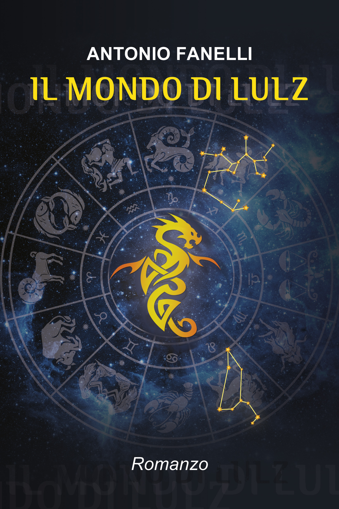

# Il Mondo di Lulz

**Il Mondo di Lulz** è un'applicazione web dedicata all'astrologia, ispirata al romanzo di Antonio Fanelli. Offre servizi astrologici personalizzati, tra cui il calcolo del Tema Natale e la consultazione dell'Oracolo.

## Caratteristiche

- **Tema Natale Personalizzato**: Generazione di una mappa celeste unica basata sulla data e sul profilo dell'utente.
- **L'Oracolo**: Un sistema interattivo per ricevere responsi personalizzati in tempo reale.
- **Download gratuito dell'eBook**: Accesso al romanzo "Il Mondo di Lulz" in formato ePub.

## Tecnologie

L'applicazione è sviluppata utilizzando:
- Node.js & Express
- EJS (Embedded JavaScript templates)
- CSS personalizzato per un'esperienza immersiva

## Immagini dal sito

### Copertina del Romanzo

## Installazione

1. Clona il repository
2. Installa le dipendenze: `npm install`
3. Configura le variabili d'ambiente nel file `.env`
4. Avvia il server: `npm start`

---
*Progetto basato sull'universo narrativo di Antonio Fanelli.*
